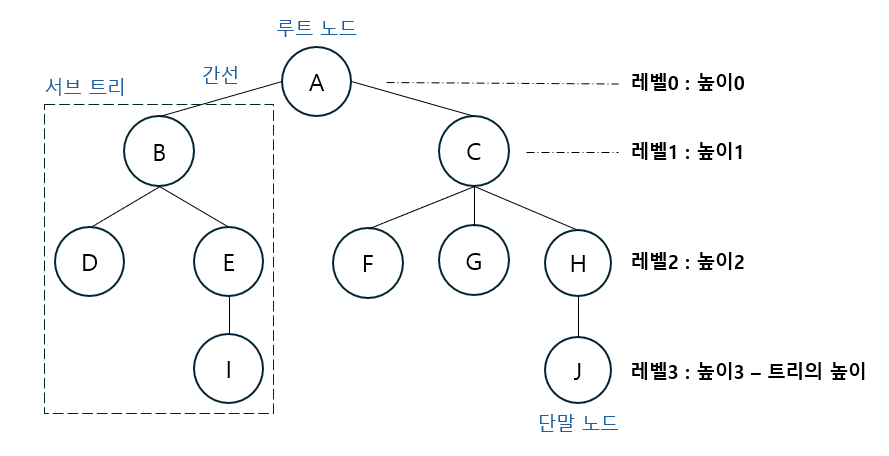

# 트리
- 비선형 자료구조
- 상위 원소에서 하위 원소로 확장되는 트리 모양의 구조

## 용어 정리
- **노드(node)** : 트리의 원소
  - A, B, C, D, E, F, G, H, I, J
- **간선(edge)** : 노드를 연결하는 선
- **루트 노드(root node)** : 트리의 시작 노드
- **형제 노드(sibling node)** : 같은 부모 노드의 자식 노드들
  - F, G, H는 형제 노드
- **조상 노드** : 간선을 따라 루트 노드까지 이르는 경로에 있는 모든 노드들
  - J의 조상 노드 : H, C, A
- **서브 트리(subtree)** : 부모 노드와 연결된 간선을 끊었을 때 생성되는 트리
- **자손 노드** : 서브 트리에 있는 하위 레벨의 노드들
  - B의 자손 노드 : D, E, I
- **단말 노드(리프 노드)** : 자식 노드가 없는 노드
- **차수(degree)**
  - 노드의 차수 : 노드에 연결된 자식 노드의 수
    - B의 차수 = 2, C의 차수 = 3
  - 트리의 차수 : 트리에 있는 차수 중에서 가장 큰 값
    - 트리의 차수 = 3
- **높이**
  - 노드의 높이 : 루트에서 노드에 이르는 간선의 수
  - 트리의 높이 : 트리에 있는 노드의 높이 중에서 가장 큰 값

# 이진 트리
- 모든 노드들이 최대 2개까지의 서브트리를 갖는 특별한 형태의 트리
- 레벨 i에서 노드의 최대 개수는 2^i개
- 높이가 h인 이진 트리가 가질 수 있는 노드의 수는 (h+1) ~ (2^(h+1)-1)개

## 종류
1. 포화 이진 트리
  - 모든 노드의 자식 노드가 2개인 이진 트리

2. 완전 이진 트리
  - 높이가 h이고 노드 수가 n개일 때, 포화 이진 트리의 노드 번호 1번부터 n번까지 빈 자리가 없는 이진 트리
  - 숫자가 왼쪽 오른쪽 번갈아가며 들어갈 때

3. 편향 이진 트리
  - 높이 h에 대한 최소 개수의 노드를 가지면서 한쪽 방향의 자식 노드만을 가진 이진 트리

## 순회
- 트리의 각 노드를 중복되지 않게 모두 방문하는 것
- 비선형 구조이므로 선후 연결 관계를 알 수 없음

1. 전위 순회
- 부모 -> 왼쪽 자식 -> 오른쪽 자식

2. 중위 순회
- 왼쪽 자식 -> 부모 -> 오른쪽 자식

3. 후위 순회
- 왼쪽 자식 -> 오른쪽 자식 -> 부모