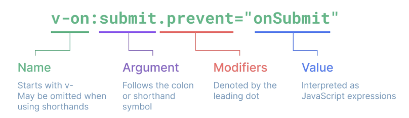

# Directive
'v-' 접두사가 있는 특수 속성

## 특징
- 속성 값은 단일 JavaScript 표현식이어야 함 (v-for, v-on 제외)
- 표현식 값이 변경될 때 DOM에 반응적으로 업데이트를 적용

## Directive 전체 구문


### Arguments
일부 directive 뒤에 콜론(":")으로 표시되는 인자를 사용

### Modifiers
"."으로 표시되는 특수 접미사로, directive가 특별한 방식으로 바인딩되어야 함을 나타냄

# Dynamically data binding
## v-bind
하나 이상의 속성 또는 컴포넌트 데이터를 표현식에 동적으로 바인딩(연결)

### 속성 바인딩 (Attribute Bindings)
HTML 속성 값을 Vue의 상태 속성 값과 동기화 되도록 함

**Dynamic attribute name (동적 인자 이름)**
- 대괄호([])로 감싸서 JavaScript 표현식을 사용할 수 있음
- `<button :[key]="myValue"></button>`
- 대괄호 안에 작성하는 이름은 반드시 소문자로만 구성 가능

### Class and Style Bindings
Vue는 class 및 style 속성 값을 v-bind로 사용할 때 ${\textsf{\color{crimson}객체}}$ 또는 ${\textsf{\color{crimson}배열}}$을 활용하여 작성할 수 있도록 함

# Event Handling
## v-on
DOM 요소에 이벤트 리스너를 연결 및 수신<br>
`v-on:event="handler"`
1. Inline handlers : 이벤트가 트리거될 때 실행될 JavaScirpt 코드
2. Method handlers : 컴포넌트에 정의된 메서드 이름

### Event Modifiers
1. stop: 이벤트 버블링을 중단하여 상위 요소로의 이벤트 전파를 막음
2. prevent: 태그의 기본 동작을 취소
3. self: 해당 요소에서 직접 발생한 이벤트만 처리

### Key Modifiers
`<input @keyup.enter="onSubmit">`
- key가 Enter일 때만 onSubmit 이벤트 호출하기
- space, delete, esc 등 다양한 키 수식어 사용 가능

# Form Input Bindings
form을 처리할 때 사용자가 input에 입력하는 값을 실시간으로 JavaScript 상태에 동기화해야 하는 경우 (양방향 바인딩)

## v-bind와 v-on 함께 사용
1. **v-bind**를 사용하여 input 요소의 value 속성 값을 입력 값으로 사용
2. **v-on**을 사용하여 input 이벤트가 발생할 때마다 input 요소의 value 값을 별도 반응형 변수에 저장하는 핸들러를 호출
```js
const inputText1 = ref('')
const onInput = function (event) {
  inputText1.value = event.currentTarget.value
}

<p>{{ inputText1 }}</p>
<input :value="inputText1" @input="onInput">
```

## v-model 사용
사용자 입력 데이터와 반응형 변수를 실시간 동기화
```js
const inputText2 = ref('')

<p>{{ inputText2 }}</p>
<input v-model="inputText2">
```